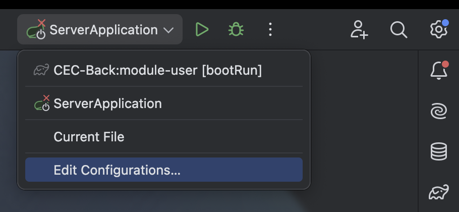
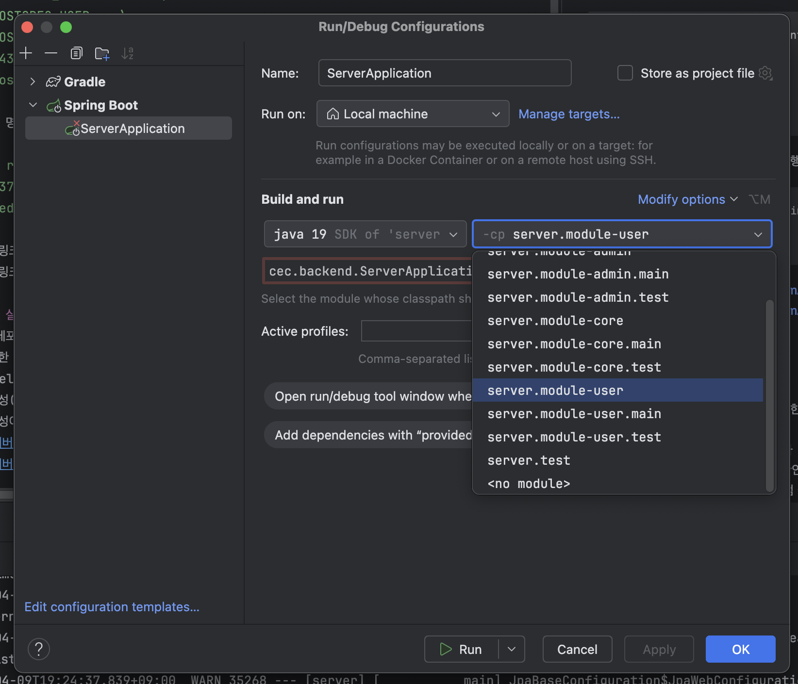

## 개발용 DB, Redis 실행 방법  (docker compose 로 간편화 예정)
1. 도커를 설치한다
2. 다음 명령어를 입력하면 DB가 실행된다.  (이 명령어는 도커를 재시작할때마다 데이터가 날아감에 주의)
```  
docker run --name postgres-container\
  -e POSTGRES_PASSWORD=1234\
  -e POSTGRES_USER=cec\
  -e POSTGRES_DB=cec\
  -p 5432:5432\
  -d postgres
```
3. 다음 명령어를 입력하면 Redis가 실행된다.
```  
docker run --name redis-container\
  -p 6379:6379\
  -d redis
```
- 참고 링크 : https://hub.docker.com/_/redis
- 참고 링크 : https://hub.docker.com/_/postgres

## 서버 실행 방법
1. 깃 레포지토리를 자기 계정으로 포크한다
2. 포크한 레포지토리를 클론한다
3. intelliJ 에서 클론한 프로젝트를 연다
4. 의존성(라이브러리)이 설치되는지 확인한다 (intelliJ 화면 하단에 뜸)
5. 의존성이 다 설치되면, 아래 사진처럼 설정하고 실행버튼을 누르면 된다.
   
   

## 디렉토리/파일 설명
- module-admin
    - module-user 와 거의 동일함
- module-user
    - src.main
        - java.cec.backend.user
            - controller
                - 컨트롤러가 위치하는 곳 (메소드 하나가 엔드포인트 하나에 대응됨)
            - service
                - 서비스가 위치하는 곳 (메소드 하나가 API의 로직에 대응됨) (컨트롤러에서는 항상 서비스의 메소드를 호출해서 처리함)
            - dto
                - 컨트롤러가 받는 요청과 응답의 JSON 형식을 지정해놓은 파일들
                - API를 만들때는, 패키지 하나를 일단 만들고, 그 안에 클래스를 만들면 됨
        - resource.user-settings
            - 설정파일이 위치하는 곳
- module-core
    - module-user 와 module-admin 이 의존성(라이브러리)으로 사용하는 모듈임.
    - src.main.java.cec.backend.core
        - config
            - 보안, DB, 스프링 등 설정파일이 위치하는 곳
        - model
            - DB에 연관된 소스코드
            - entity
                - 엔티티(테이블 마다 존재함) 이 위치하는 곳
            - repository
                - DB에 날리는 쿼리가 위치하는 곳 (메소드 하나가 sql 쿼리에 대응됨)
- docs
    - 본 문서가 저장되는 위치
- build.gradle
    - 모든 모듈이 사용하는 의존성(라이브러리) 목록
    - 프로젝트에 대한 설정

## 규칙 (04-09 07:16)
1. feat : 작업내용, fix : 작업내용, chore : 작업내용 과 같이 커밋 컨벤션 잘 지키기
    - 두줄 이상 커밋 메세지를 적는 것도 적극 권장함
    - [커밋 컨벤션 참고 링크](https://velog.io/@shin6403/Git-git-%EC%BB%A4%EB%B0%8B-%EC%BB%A8%EB%B2%A4%EC%85%98-%EC%84%A4%EC%A0%95%ED%95%98%EA%B8%B0)
2. 커밋할때는 실행이 가능할때만 커밋하기
3. 커밋할때는 컴파일시 뜨는 경고문구도 최대한 해결해서 커밋하기
4. private 레포지토리를 만들어서 그곳에 user-settings, admin-settings 등 설정파일을 저장하기
    - 설정파일이 업데이트 되면 팀원들에게 알려서 각자 받아가도록 하기
5. 가능하면 DTO 안에 [toEntity 메소드](../module-user/src/main/java/cec/backend/user/dto/test/CreateTestRequest.java) 처럼 엔티티로 바꾸는 메소드나, [엔티티로 생성하는 생성자](../module-user/src/main/java/cec/backend/user/dto/test/TestResponse.java) 를 만들고 최대한 사용할것.
6. 작업하기 전에, "feature/기능명" 처럼 브랜치를 나누고 작업하고, pr을 날릴때 메인 브랜치로 pr한다. (GtiHub Flow)  